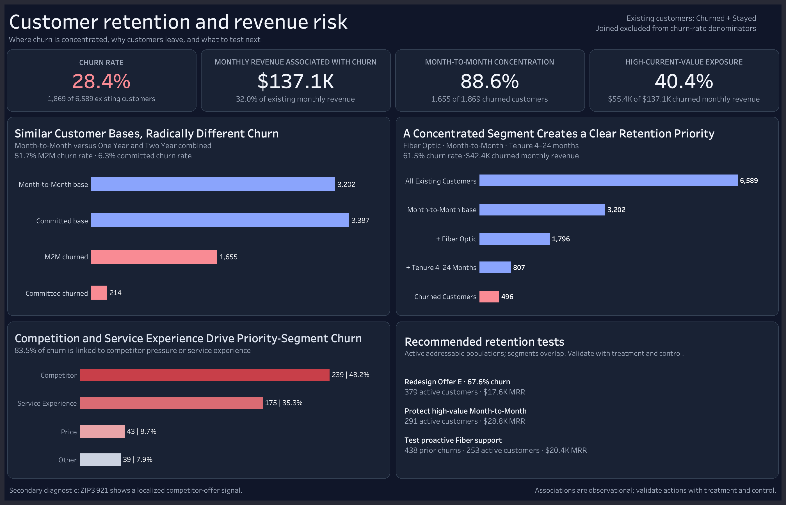
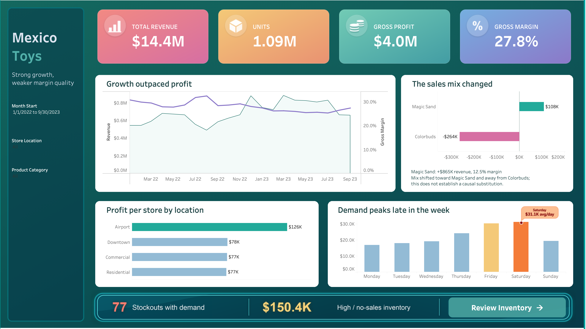
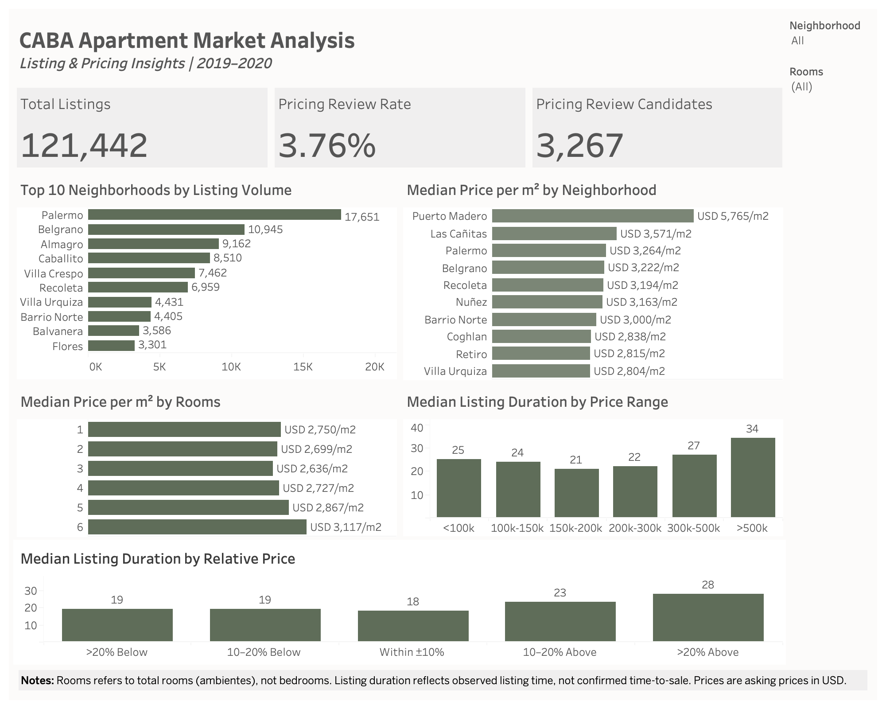
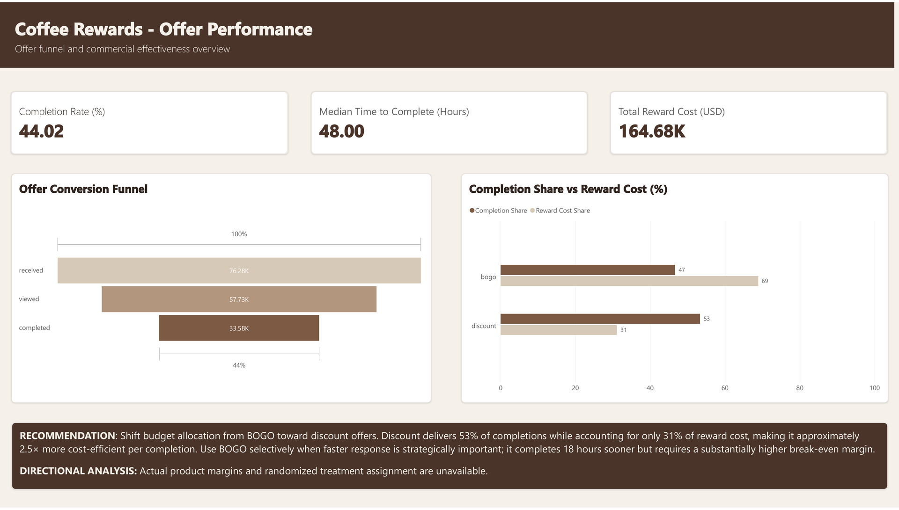

# Dana Amantini

### Data Analyst

Turning data into clear, actionable business insights.

I'm a Data Analyst focused on transforming complex datasets into meaningful insights and clear visual stories. My projects cover real-world business problems across customer retention, retail, real estate, and marketing.

**Tools:** SQL · Python · Pandas · Excel · Tableau · Power BI

---

## 📊 Projects

| # | Project | Focus | Tools |
|---|---------|-------|-------|
| **01** | [Telecom Customer Churn](#01--telecom-customer-churn) | Customer retention & churn | SQL · Power BI |
| **02** | [Mexico Toy Sales](#02--mexico-toy-sales) | Sales & inventory | Excel · Power Query · SQL · Tableau |
| **03** | [CABA Real Estate Market Analysis](#03--caba-real-estate-market-analysis) | Market & pricing analysis | Python · Pandas · Tableau |
| **04** | [Coffee Rewards](#04--coffee-rewards) | Customer & offer analysis | Python · SQL · Power BI |

---

### 01 · 📡 Telecom Customer Churn

Customer churn analysis focused on identifying behavioral patterns, high-risk customer segments, and factors associated with customer retention.

**Tools:** SQL · Power BI

[View Full Project →](https://github.com/Danaamantini/telecom-customer-churn-dana)

---

### 02 · 🛒 Mexico Toy Sales

Retail sales and inventory analysis across 50 toy stores in Mexico, identifying sales performance, profitability, stockouts, and inventory optimization opportunities.

**Tools:** Excel · Power Query · SQL · Tableau

[View Full Project →](https://github.com/Danaamantini/mexico-toys)

---

### 03 · 🏙️ CABA Real Estate Market Analysis

Analysis of apartment listings in Buenos Aires to explore market supply, pricing patterns, price per square meter, and differences across neighborhoods.

**Tools:** Python · Pandas · Tableau

[View Full Project →](https://github.com/Danaamantini/caba-real-estate-market-analysis)

---

### 04 · ☕ Coffee Rewards

Customer and offer analysis exploring campaign performance, customer behavior, offer completion, and opportunities to improve marketing effectiveness.

**Tools:** Python · SQL · Power BI

[View Full Project →](https://github.com/Danaamantini/coffee-rewards)

---

## 🛠️ Skills

**Data Analysis:** SQL · Python · Pandas · Excel · Power Query  
**Visualization:** Tableau · Power BI  
**Workflow:** Git · GitHub · Jupyter Notebook  
**Focus:** Data Cleaning · Exploratory Data Analysis · Business Analysis · Data Visualization

---

## 📫 Contact

**GitHub:** [Danaamantini](https://github.com/Danaamantini)

**LinkedIn:** Coming soon
